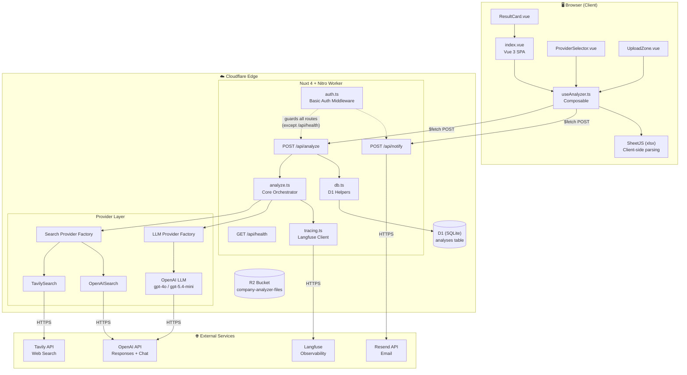
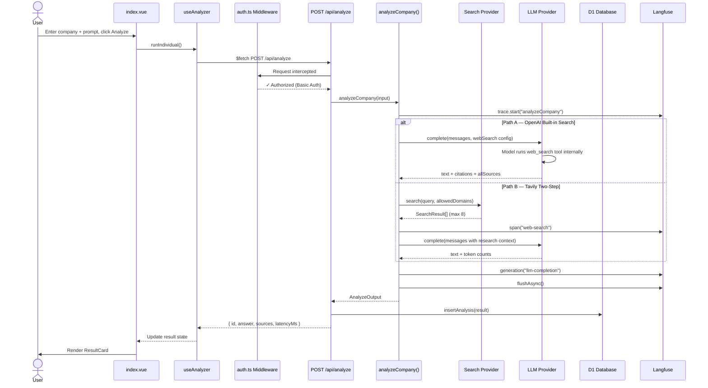
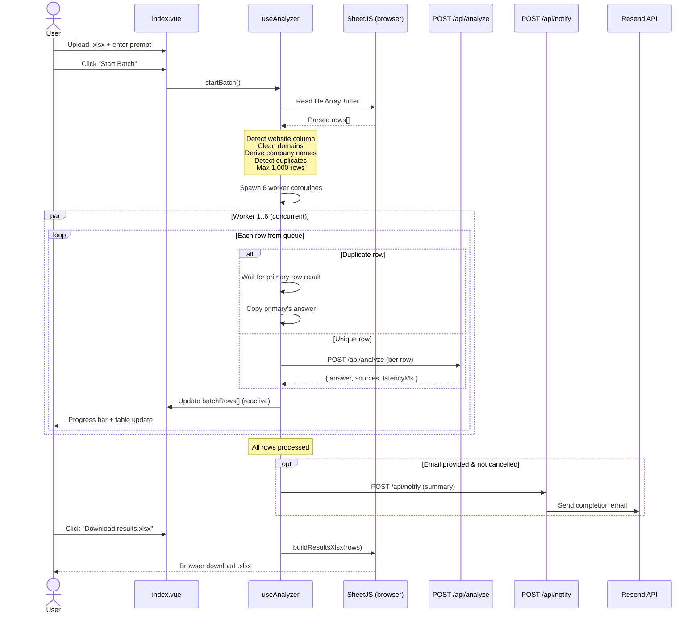
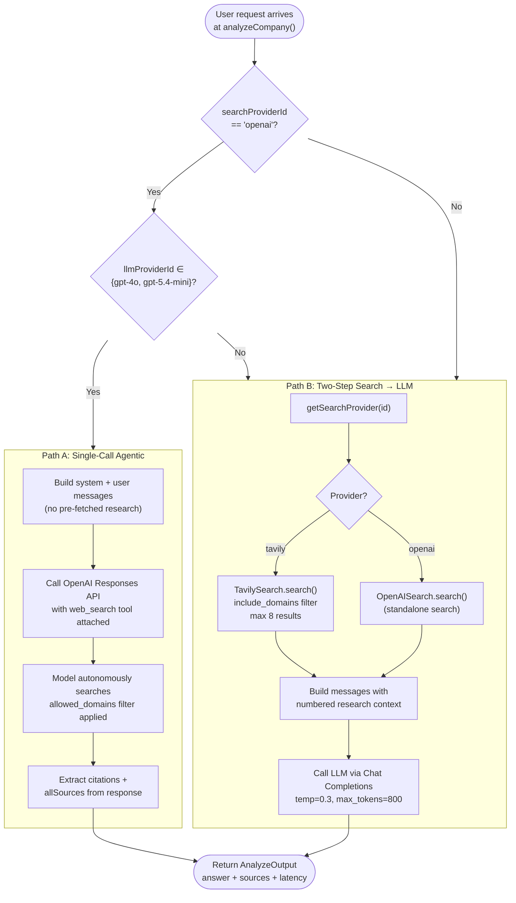
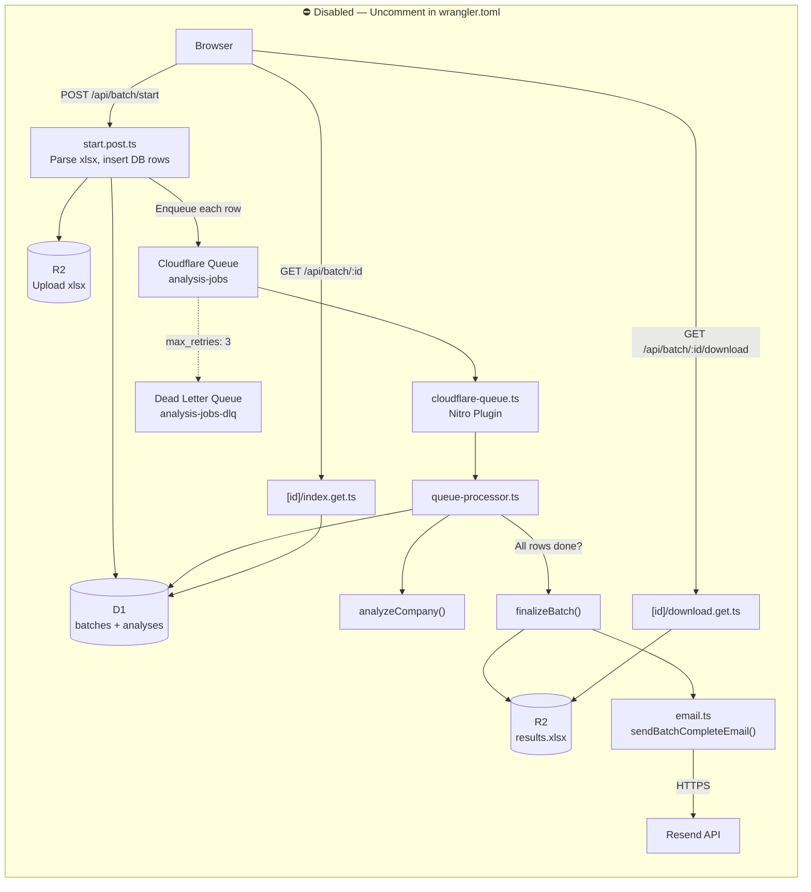
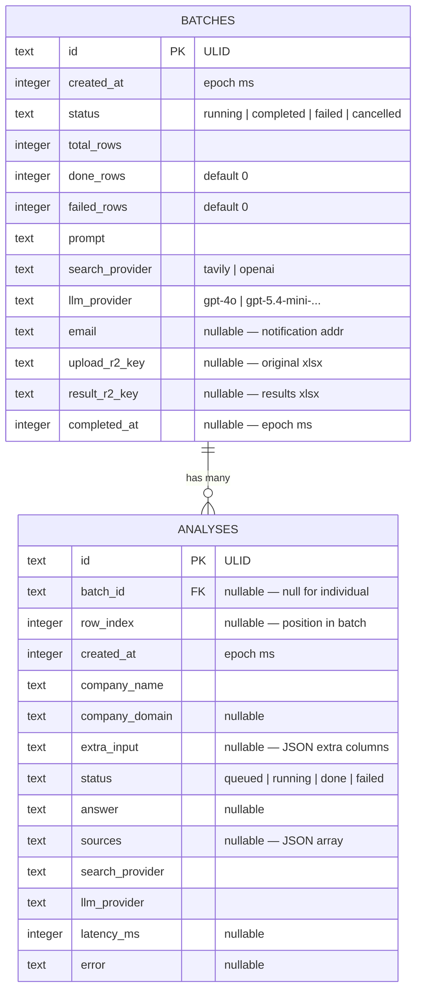
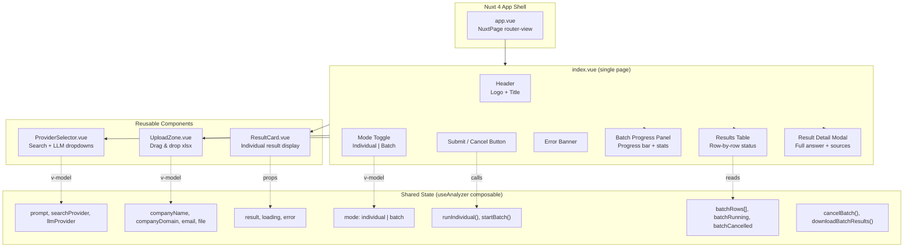

# 🔍 Baseera — Company Analyzer

> **AI-powered company research at scale.** Feed it a company website, ask anything, and get a sourced answer in seconds. Built for sales-qualification workflows where you need to screen hundreds of leads quickly.

<p align="center">
  <a href="#-live-demo">Live Demo</a> •
  <a href="#-quick-start">Quick Start</a> •
  <a href="#-tech-stack">Tech Stack</a> •
  <a href="#-deployment">Deployment</a> •
  <a href="#-architecture">Architecture</a>
</p>

---

## 🎯 What it does

Pick an LLM, a search strategy, and either:

1. **Individual mode** → analyze one company in real-time (server-side)
2. **Batch mode** → upload an Excel of up to 1,000 companies. **Runs entirely in your browser** (no Cloudflare Queues / paid plan needed). Optional email notification when finished.

The agent reads **only the company's own website** (domain-restricted search), then writes a sourced answer with citations.

### Excel input format

The xlsx must contain at least **one** of these columns (case-insensitive):

- `name` / `company` / `company name` — company name
- `domain` / `website` / `url` — company URL or domain

If only a URL column is provided, the company name is auto-derived (e.g. `https://www.ejada.com` → name **Ejada**, domain **ejada.com**). Any extra columns are preserved and re-emitted in the output xlsx.

---

## 🚀 Live Demo

**Production URL:** [https://company-analyzer.thinktech-baseera.workers.dev](https://company-analyzer.thinktech-baseera.workers.dev)

> 🔒 Protected by HTTP Basic Auth. Contact [mahmoud.abdelhamid@thinktech-it.com](mailto:mahmoud.abdelhamid@thinktech-it.com) for credentials.

---

## 🛠️ Tech Stack

### Frontend

| Layer | Technology | Why |
|-------|------------|-----|
| **Framework** | [Nuxt 4](https://nuxt.com) (Vue 3) | File-based routing, SSR-ready, Cloudflare-native |
| **Styling** | [Tailwind CSS v4](https://tailwindcss.com) | Utility-first, zero-config with Vite plugin |
| **State** | Nuxt `useState` composables | Reactive, SSR-safe shared state |
| **Icons** | [Lucide Vue](https://lucide.dev) | Tree-shakeable SVG icons |
| **Build** | Vite (via Nuxt) | Sub-second HMR |

### Backend

| Layer | Technology | Why |
|-------|------------|-----|
| **Runtime** | [Cloudflare Workers](https://workers.cloudflare.com) | Edge-deployed, ~50ms cold start |
| **Server framework** | [Nitro](https://nitro.unjs.io) (Nuxt's engine) | Single-codebase frontend + API |
| **HTTP layer** | [H3](https://h3.unjs.io) | Built-in to Nitro, lightweight |
| **Language** | TypeScript 5+ | Type safety end-to-end |

### Data & Infrastructure

| Layer | Technology | Free tier |
|-------|------------|-----------|
| **Database** | [Cloudflare D1](https://developers.cloudflare.com/d1/) (SQLite at the edge) | 5 GB, 25M reads/day |
| **File storage** | [Cloudflare R2](https://developers.cloudflare.com/r2/) (S3-compatible) | 10 GB, unlimited egress |
| **Background jobs** | [Cloudflare Queues](https://developers.cloudflare.com/queues/) | Requires Workers Paid ($5/mo) |
| **Email** | [Resend](https://resend.com) | 100/day, 3,000/month free |

### AI & Observability

| Layer | Technology | Use |
|-------|------------|-----|
| **LLM** | OpenAI `gpt-4o`, `gpt-5.4-mini-2026-03-17` | Reasoning + answer generation |
| **Web Search (built-in)** | OpenAI Responses API `web_search` tool | Domain-filtered agentic search |
| **Web Search (external)** | [Tavily API](https://tavily.com) | Two-step search → LLM flow |
| **Tracing** | [Langfuse](https://langfuse.com) | Full request/response logging |

---

## ⚡ Quick Start

### Prerequisites

- Node.js 18+
- A Cloudflare account ([free signup](https://dash.cloudflare.com/sign-up))
- API keys: [OpenAI](https://platform.openai.com/api-keys), [Tavily](https://tavily.com), [Resend](https://resend.com), [Langfuse](https://langfuse.com)

### 1️⃣ Install

```bash
git clone <this-repo>
cd Baseera
npm install
```

### 2️⃣ Configure local env

Create `.dev.vars` in the project root:

```ini
OPENAI_API_KEY=sk-...
TAVILY_API_KEY=tvly-dev-...
RESEND_API_KEY=re_...
LANGFUSE_SECRET_KEY=sk-lf-...
LANGFUSE_PUBLIC_KEY=pk-lf-...
LANGFUSE_BASE_URL=https://us.cloud.langfuse.com
```

### 3️⃣ Build & run locally

```bash
npm run build
npx wrangler dev
```

Open **http://127.0.0.1:8787**.

> **Note:** Use `wrangler dev`, **not** `npm run dev`. Nuxt 4's dev server has Windows ESM issues with the Cloudflare preset.

---

## 🌍 Deployment

### Step 1 — Login to Cloudflare

```bash
npx wrangler login
```

### Step 2 — Create infrastructure

```bash
# D1 database — copy the printed database_id into wrangler.toml line 9
npx wrangler d1 create company-analyzer-db

# R2 bucket
npx wrangler r2 bucket create company-analyzer-files

# Apply schema (managed via migrations folder)
npx wrangler d1 migrations apply company-analyzer-db --remote

# Queues — ONLY if you upgrade to Workers Paid plan ($5/mo) and want server-side batch.
# Skip this on the free plan; batch will run in the browser instead.
# npx wrangler queues create analysis-jobs
# npx wrangler queues create analysis-jobs-dlq
```

### Step 3 — Set secrets

```bash
npx wrangler secret put OPENAI_API_KEY
npx wrangler secret put TAVILY_API_KEY
npx wrangler secret put RESEND_API_KEY
npx wrangler secret put LANGFUSE_SECRET_KEY
npx wrangler secret put LANGFUSE_PUBLIC_KEY
```

### Step 4 — Deploy

```bash
npm run build
npx wrangler deploy
```

You'll get a `https://<app>.<subdomain>.workers.dev` URL. Done.

### Future updates

```bash
npm run build
npx wrangler deploy
```

---

## 🏗️ Architecture

### High-Level System Topology

The entire system is deployed as a single **Cloudflare Worker**. Frontend (Nuxt 4 / Vue 3) and backend (Nitro / H3) ship together.



### Individual Analysis — Request Flow

Single company analysis: user fills form → `POST /api/analyze` → search → LLM → response.



### Batch Analysis — Browser-Side Flow

Batch mode: the browser orchestrates everything. No server-side queues needed.



### AI Provider Strategy — Decision Tree

The orchestrator picks a fundamentally different execution path based on the user's search provider choice.



### Server-Side Batch (Disabled — In Codebase)

These components exist in the codebase but are **disabled** in `wrangler.toml`. Requires Cloudflare Workers Paid ($5/mo). Uncomment the `[[queues.*]]` blocks to re-enable.



### Data Model — D1 Schema



### Frontend Component Hierarchy



---

## 🧠 The Agent

Two execution paths depending on your provider choice:

### Path A: External search → LLM (two-step)

Triggered when **SEARCH = Tavily**. The flow:

1. Build a query from `companyName + domain + website`
2. Tavily searches, restricted to the company domain via `include_domains`
3. Top 8 results passed to LLM as numbered context
4. LLM (`gpt-4o` or `gpt-5.4-mini`) writes a sourced answer

### Path B: Agentic LLM with built-in search (single call)

Triggered when **SEARCH = OpenAI**. The flow:

1. The LLM is called via OpenAI Responses API
2. The `web_search` tool is attached with `filters.allowed_domains: [<company domain>]`
3. The model **decides** what to search for, can run multiple searches, and reads pages
4. Returns the final answer with `url_citation` annotations + complete `sources` list

For `gpt-5.4-mini`, `reasoning.effort: "low"` is set to keep latency reasonable while still benefiting from chain-of-thought.

---

## ⚙️ Active Configuration

These are the parameters the app currently uses. Tune them by editing the file noted in each row.

### LLM

| Parameter | Value | Where it's set |
|---|---|---|
| Default LLM | `gpt-5.4-mini-2026-03-17` | UI selector (`app/components/ProviderSelector.vue`) |
| Alternate LLM | `gpt-4o` | UI selector |
| `max_output_tokens` | **800** | `server/utils/analyze.ts` |
| `temperature` | `0.3` (chat models only) | `server/utils/providers/llm/openai.ts` |
| `reasoning.effort` (gpt-5/o-models) | **`low`** | `server/utils/providers/llm/openai.ts` |
| API used | OpenAI **Responses API** for reasoning models OR when web_search is needed; otherwise **Chat Completions** | `server/utils/providers/llm/openai.ts` |

### Web search

| Parameter | Value | Where it's set |
|---|---|---|
| Built-in search (OpenAI) — `search_context_size` | **`high`** | `server/utils/analyze.ts` |
| Built-in search — `tool_choice` | `{ type: "web_search" }` (forced) | `server/utils/providers/llm/openai.ts` |
| Built-in search — domain filter | `filters.allowed_domains: [<companyDomain>]` (max 100) | `server/utils/providers/llm/openai.ts` |
| External search (Tavily) — `max_results` | **8** | `server/utils/analyze.ts` |
| External search (Tavily) — `searchContextSize` | **`high`** | `server/utils/analyze.ts` |
| External search (Tavily) — domain filter | `include_domains: [<companyDomain>]` | `server/utils/providers/search/tavily.ts` |

### Batch mode (browser-side)

| Parameter | Value | Where it's set |
|---|---|---|
| Execution | Runs **in the browser tab** — no server queue | `app/composables/useAnalyzer.ts` |
| Concurrency | **6 rows in parallel** | `app/composables/useAnalyzer.ts` (`CONCURRENCY`) |
| Max rows | **1,000** | `app/composables/useAnalyzer.ts` |
| Email notify | Optional. Browser POSTs `/api/notify` after the loop completes (Resend) | `server/api/notify.post.ts` |
| Output | Client-side xlsx download, no R2 storage | `app/composables/useAnalyzer.ts` (`downloadBatchResults`) |

> **Want server-side batch back?** It's already wired (queue producer/consumer, R2 result storage, scheduled emails). Uncomment the `[[queues.*]]` blocks in `wrangler.toml`, run `npx wrangler queues create analysis-jobs && npx wrangler queues create analysis-jobs-dlq`, and switch `startBatch()` in `useAnalyzer.ts` back to the server flow. Requires Workers Paid ($5/mo).

---

## 💰 Cost Comparison

Measured on real 20-row batches (one analysis per row), then linearly extrapolated. Numbers are **OpenAI cost only** — add Tavily fees if you exceed its free tier (1,000 calls/month).

| Combo | Per 20 (measured) | Per 1,000 (estimated) |
|-------|---|---|
| OpenAI search + **GPT-5.4 Mini** (`ctx=high`, current default) | $0.7297 | **~$36.49** |
| OpenAI search + **GPT-4o-mini** equivalent (cheap LLM, `ctx=high`) | $0.1635 | **~$8.17** ⭐ cheapest |
| Tavily + GPT-5.4 Mini | ~$0.10 | **~$5–10** |

**Tavily fees:** free up to 1,000 calls/month. Beyond that ~$30/mo for 4,000 calls.

> Tip: For high-volume screening, use **Tavily + GPT-5.4 Mini**. For best quality on important leads, use **OpenAI search + GPT-5.4 Mini** with `ctx=high` (the current default).

---

## 📂 Project Structure

```
Baseera/
├── app/                          # Frontend (Vue + Nuxt)
│   ├── pages/                    # Routes — single-page (index.vue)
│   ├── components/               # ProviderSelector, ResultCard, UploadZone
│   ├── composables/              # useAnalyzer (parses xlsx + runs batch in browser)
│   └── assets/css/main.css       # Tailwind entry
│
├── server/                       # Backend (Nitro)
│   ├── api/                      # API routes
│   │   ├── analyze.post.ts       # Per-row analysis (called from individual + browser-batch)
│   │   ├── notify.post.ts        # Sends batch-complete email (Resend)
│   │   ├── batch/                # Server-side batch (kept for when Queues are enabled)
│   │   └── health.get.ts
│   ├── plugins/cloudflare-queue.ts
│   └── utils/
│       ├── analyze.ts            # Core orchestrator
│       ├── providers/            # Search & LLM providers
│       │   ├── search/{tavily,openai}.ts
│       │   └── llm/openai.ts
│       ├── queue-processor.ts    # Batch worker
│       ├── excel.ts              # XLSX parse/generate
│       ├── email.ts              # Resend integration
│       ├── db.ts                 # D1 helpers
│       ├── r2.ts                 # R2 helpers
│       └── tracing.ts            # Langfuse
│
├── shared/types.ts               # Shared TS types (client + server)
├── migrations/0001_init.sql      # D1 schema
├── wrangler.toml                 # Cloudflare deploy config
├── nuxt.config.ts
└── package.json
```

---

## 🧪 Test the API

### Individual mode

```bash
curl -X POST https://company-analyzer.thinktech-baseera.workers.dev/api/analyze \
  -H "Content-Type: application/json" \
  -d '{
    "companyName": "ThinkTech IT",
    "companyDomain": "thinktech-it.com",
    "prompt": "What does this company do?",
    "searchProviderId": "openai",
    "llmProviderId": "gpt-5.4-mini-2026-03-17"
  }'
```

### Health check

```bash
curl https://company-analyzer.thinktech-baseera.workers.dev/api/health
```

---

## 🔭 Observability

Every analysis is traced in [Langfuse](https://cloud.langfuse.com):

- Root trace: `analyzeCompany` with input/output
- Span: `web-search` with query + result count
- Generation: `llm-completion` with full prompt, model, tokens, answer

View live logs in the Cloudflare dashboard → Workers → `company-analyzer` → Logs, or run:

```bash
npx wrangler tail
```

---

## ⚙️ Configuration Reference

### Environment Variables (`wrangler.toml [vars]`)

| Var | Purpose |
|-----|---------|
| `APP_BASE_URL` | Used in batch download links sent in emails |
| `EMAIL_FROM` | Sender for batch completion emails (Resend) |

### Secrets (`wrangler secret put <NAME>`)

| Secret | Source |
|--------|--------|
| `OPENAI_API_KEY` | https://platform.openai.com/api-keys |
| `TAVILY_API_KEY` | https://app.tavily.com/home |
| `RESEND_API_KEY` | https://resend.com/api-keys |
| `LANGFUSE_SECRET_KEY` | https://cloud.langfuse.com (project settings) |
| `LANGFUSE_PUBLIC_KEY` | https://cloud.langfuse.com (project settings) |

---

## 📝 License & Credits

Built by [ThinkTech IT](https://thinktech-it.com) for internal lead-qualification workflows.

Powered by:
- [Nuxt](https://nuxt.com) — full-stack Vue framework
- [Cloudflare Workers](https://workers.cloudflare.com) — edge compute
- [OpenAI](https://openai.com) — LLM + agentic web search
- [Tavily](https://tavily.com) — research-grade web search
- [Resend](https://resend.com) — transactional email
- [Langfuse](https://langfuse.com) — LLM observability

---

<p align="center">
  <sub>Made with ☕ in Cairo</sub>
</p>
